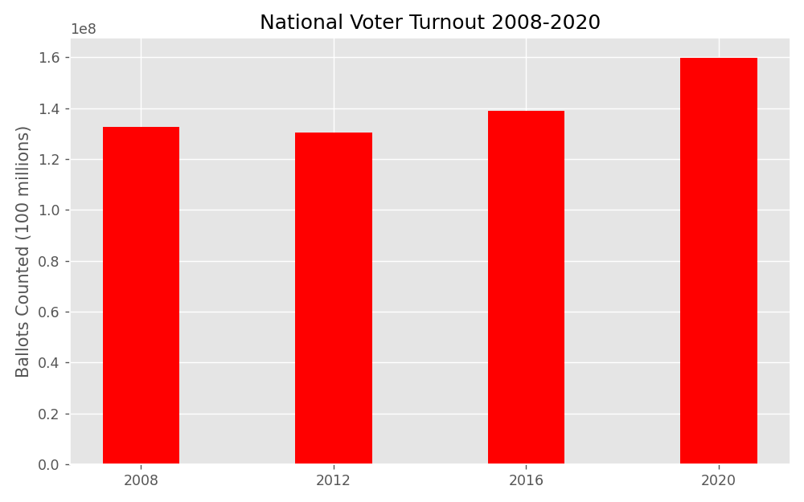
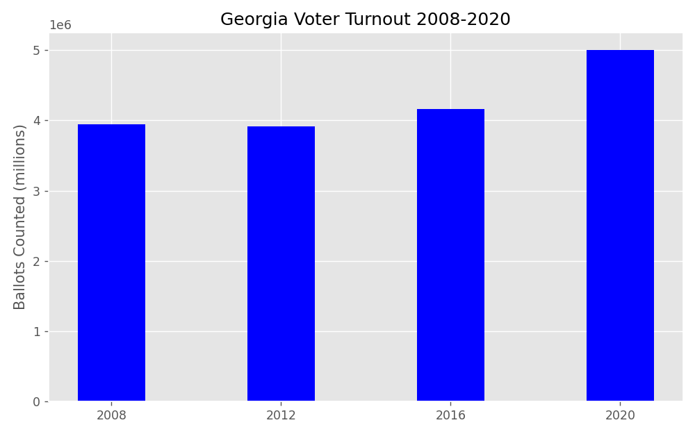
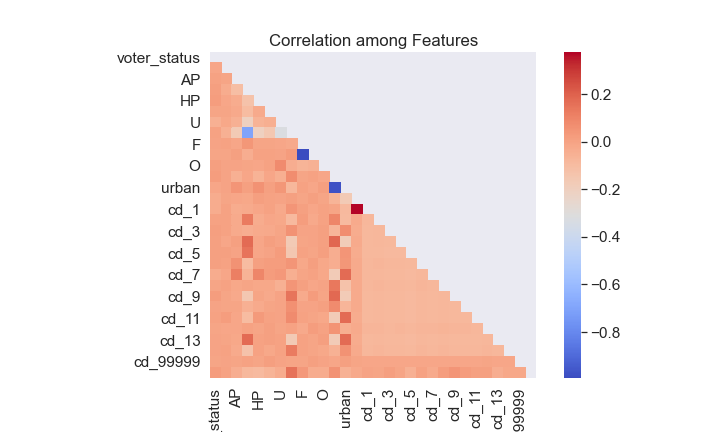
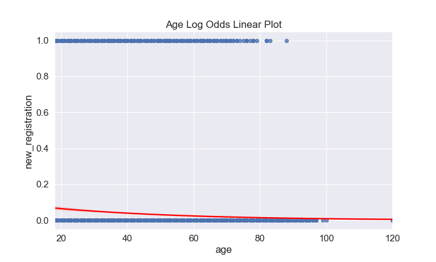

# New Voter Insights and Analysis

This project features the use of python scripts for data retrieval and modeling, notebooks for EDA and images along with explanatory slides for the sake of summary and illustration. The associated files may be found in the following directories:

- data for a sample of the raw data
- home directory for README and slides
- images for visualization
- notebooks for EDA
- src for scripts

## Motivation
The 2020 United States General Election highlighted some of the changing features of the US electorate that may remain with us for elections to come. In particular, Georgia voters complicated assumptions about voters in southern states with their unexpected support for Democrats. Given the [historic turnout](http://www.electproject.org/) in the election nationally and at the state level in Georgia, we might conclude that the unexpected results in Georgia owed in part to the behavior of newly registered voters. Accordingly, a complete account of election results in Georgia would involve developing our understanding of the characteristics of newly registered voters. Through inferential logistic regression, I will evaluate Georgia Voter Registration Records to isolate the features most associated with newly registered voters. 

In the event that such features cannot be isolated, I will explain how the analysis identified this failure.

## Georgia Voter Registration Dataset
The American Voter Project has made Voter Registration Records from the Georgia Secretary of State spanning the period from October to December 2020 available to the public through [Kaggle](https://www.kaggle.com/gabrielaltay/georgia-voter-list-202011). The records consist primarily of .csv and .geojson files, of which the .csv files tabulate both the total electorate during the period and subsets of tables for new voters, dropped voters, voters with changed voting status and tables of active and inactive voters.

### Preparing and Cleaning the Data
For the purposes of identifying new voters in the Georgia electorate, four tables need to be combined. First, the tables of new registrations for the period (October, November, December) are combined into a master list of new voters. 

| New Voters from Combined New Voter Registration Tables  | New Voters from December Voter Registration Records |
|:-------------------------------------------------------:|:---------------------------------------------------:|
|                          274535                         |                        270423                       |

Second, using the voter registration numbers from that table to identify new voters in the general list of all registered voters as of December 2020, I created a "new registration" column on the December general voter table to provide a binary indication of whether an individual could be considered "new" (that is, registered during the period) and assigned a value of 1, with the remainder being assigned a value of zero.

With the data combined into a single file containing all available independent and dependent variables, the next task is to isolate the features that a logistic regression model can evaluate. Accordingly, null-values and "object" datatypes need to be eliminated or represented as numerical or categorical features. Many columns of the dataset contain significantly limited or redundant information.

| #  | Column                     | Non-Null Count | Dtype   |
|----|----------------------------|----------------|---------|
| 1  | land_district              | 62601          | object  |
| 2  | land_lot                   | 62597          | object  |
| 3  | status_reason              | 59             | object  |
| 4  | county_districta_name      | 4906           | object  |
| 5  | county_districta_value     | 4906           | object  |
| 6  | county_districtb_name      | 26491          | object  |
| 7  | county_districtb_value     | 26491          | object  |
| 8  | city_school_district_name  | 24949          | object  |
| 9  | city_school_district_value | 24949          | object  |
| 10 | city_dista_name            | 0              | float64 |
| 11 | city_dista_value           | 0              | float64 |
| 12 | city_distb_name            | 0              | float64 |
| 13 | city_distb_value           | 0              | float64 |
| 14 | city_distc_name            | 0              | float64 |
| 15 | city_distc_value           | 0              | float64 |
| 16 | city_distd_name            | 0              | float64 |
| 17 | city_distd_value           | 0              | float64 |
| 18 | party_last_voted           | 1666           | object  |

Of the former, "county_districta_name", "status_reason" and "city_school_district_name" contained predominantly null values, even among the subset of new voters and were dropped accordingly. Of the latter, geographic divisions accounted for the majority of the 46 features in the combined total voter registration list. For example, "county_code", "residence_city", "residence_zipcode" and roughly 28 other features all approximate, to varying levels of granularity, the geographic distribution of voters and were consolidated to more manageable levels.

The majority of geographic distinctions were simply dropped due to a combination of redundancy and the difficulty of featurizing these categories for use in the model. With the exception of "birthyear" (which was subsequently refactored as the numerical value, "age"), every feature in the combined dataset represented a category. In order to avoid the nighmare of featurizing "residence_zipcode" into more than 3000 one-hot encoded categories, this column was dropped.

Yet, with other geographic categories, such as Georgia's 159 counties or 14 congressional districts, their potential predictive value outweighed the difficulties of representing them categorically. Representing 15 congressional districts (some voters could not be classified and were assigned to district 9999) as 15 one-hot encoded categories posed little difficulty. The same could be said for Georgia counties, but I decided to spare the model from parsing 159 counties and instead broke counties down into three socio-economic subsets: urban counties, rural counties and counties with a majority military population. With the addition of one-hot encoded gender and racial categories, the final data set consisted of more than 7 million records represented by 30 features.

| #   | Column       | Non-Null Count | Dtype |
|-----|--------------|----------------|-------|
| 1   | voter_status | 6183143        | int64 |
| 2   | AI           | 6183143        | int64 |
| 3   | AP           | 6183143        | int64 |
| 4   | BH           | 6183143        | int64 |
| 5   | HP           | 6183143        | int64 |
| 6   | OT           | 6183143        | int64 |
| 7   | U            | 6183143        | int64 |
| 8   | WH           | 6183143        | int64 |
| 9   | F            | 6183143        | int64 |
| 10  | M            | 6183143        | int64 |
| 11  | O            | 6183143        | int64 |
| 12  | rural        | 6183143        | int64 |
| 13  | urban        | 6183143        | int64 |
| 14  | military     | 6183143        | int64 |
| 15  | cd_1         | 6183143        | int64 |
| ... | ...          | ...            | ...   |
| 29  | cd_99999     | 6183143        | int64 |
| 30  | age          | 6183143        | int64 |

## Assumptions of Logistic Regression
Inferential analysis sacrifices predictive power in order to confirm its assertions about the role coefficients play in relation to a model's target category. With logistic regression, these assumptions include:

1. a binary dependent variable: "new_registration" = 1 for new, 0 for existing
2. independent observation: being what they are, voter registration records may be assumed independent in the absence of massive voter fraud
3. little or no multicollinearity among independent variable: the Pearson correlation matrix below suggests no significant collinearity among our features

4. linearity of continuous independent variables with log odds: as this only applies to the "age" feature, linearity can be seen in the plot below

5. a large sample size calculated using the heuristic 10 samples of the least frequent outcome multiplied by the number of features divided by the probability of the least frequent outcome: with 30 features and 260k samples of the newly registered voters, which occur at a rate of 3.4 per hundred registrations, the model easily reaches this heuristic threshold for sample size

By confirming the assumptions of logistic regression, the coefficient values calculated by the model can confidently be attributed to the corresponding feature such that a change in the log odds of any feature can confidently be attributed to a log odds change in the target value.

## Logistic Regression Model of New Voter Registration
Despite meeting the assumptions of logistic regression, the researcher always runs the risk that there is simply no connection between a model's features and targets. To verify whether the features were significant in predicting the target, I calculated the p-values for the entirety of the feature set and found that only two features carried any predictive value for the target.

| Logit Regression Results |

|  Dep. Variable:  | y                | No. Observations: | 6181531     |
|:----------------:|------------------|-------------------|-------------|
| Model            | Logit            | Df Residuals:     | 6181500     |
| Method:          | MLE              | Df Model:         | 30          |
| Date:            | Thu, 01 Apr 2021 | Pseudo R-squ.:    | 0.04466     |
| Time:            | 16:26:52         | Log-Likelihood:   | -8.9655e+05 |
| converged:       | False            | LL-Null:          | -9.3846e+05 |
| Covariance Type: | nonrobust        | LLR p-value:      | 0.000       |

| feature      | coef    | std err  | z         | P>\|z\| | [0.025    | 0.975]   |
|--------------|---------|----------|-----------|---------|-----------|----------|
| Intercept    | -4.3755 | 9.31e+04 | -4.7e-05  | 1.000   | -1.82e+05 | 1.82e+05 |
| voter_status | 5.5953  | 0.147    | 37.940    | 0.000   | 5.306     | 5.884    |
| AI           | -0.4067 | 6.13e+04 | -6.63e-06 | 1.000   | -1.2e+05  | 1.2e+05  |
| ...          | ...     | ...      | ...       | ...     | ...       | ...      |
| F            | -0.8820 | 9.1e+04  | -9.69e-06 | 1.000   | -1.78e+05 | 1.78e+05 |
| ...          | ...     | ...      | ...       | ...     | ...       | ...      |
| rural        | -1.3781 | 1.48e+05 | -9.34e-06 | 1.000   | -2.89e+05 | 2.89e+05 |
| ...          | ...     | ...      | ...       | ...     | ...       | ...      |
| cd_1         | -0.1082 | 1.03e+05 | -1.05e-06 | 1.000   | -2.01e+05 | 2.01e+05 |
| ...          | ...     | ...      | ...       | ...     | ...       | ...      |
| age          | -0.0267 | 0.000    | -194.377  | 0.000   | -0.027    | -0.026   |

Predictably, the only two features that carried any significance when determining whether a voter was new or existing related to voter status (new voters tend to be registered as active rather than inactive) and age (new voters tend to be younger).

## Conclusions and Next Steps
This project began with the intention to isolate the features of newly registered voters through an inferential logistic regression analysis that would sacrifice predictive capacity in order to demonstrate a strong link establishing the feature set as those traits most solidly assocated with new voters.

Although the assumptions of logistic regression were demonstrated, this is no guaranty that the feature set is highly correlated with the target category. Indeed, the only features that could be significantly associated with new voter status were the trivially predictable attributes of being active voter and age.

While disappointing from the perspective of identifying unexpected attributes of new voters, the analysis indicates that there is no apparent demographic or geograpthic categorization within the data that strongly correlates new voter registration over another.

Accordingly, a proper identification on new voter characteristics would either need an expanded dataset that includes additional demographic features beloning to the entire voting age population rather or significantly more feature engineering capable of deriving traits otherwise implicit in the current dataset.